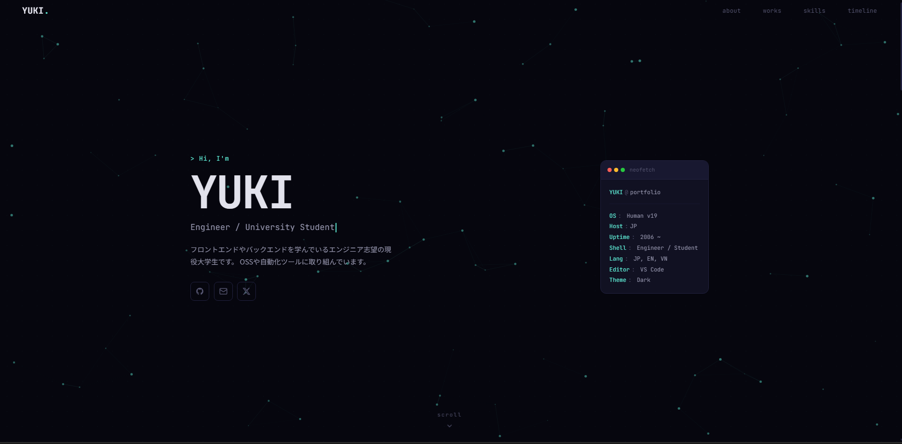

# YUKI | Portfolio

個人ポートフォリオサイト。React (UMD) + Vanilla JS で構築したサイト。

<p align="center">
  
</p>

## 構成

```
Portfolio.html          エントリーポイント
portfolio.css           スタイル
portfolio-app.jsx       アプリルート・ナビゲーション
portfolio-sections-a.jsx  Hero・About セクション
portfolio-sections-b.jsx  Works・Skills・Timeline・Footer セクション
particles-canvas.jsx    背景パーティクルアニメーション
tweaks-panel.jsx        デザイン調整パネル
assets/images/          プロジェクトスクリーンショット
```